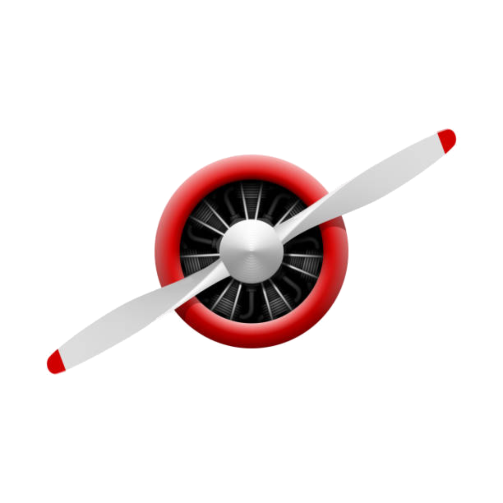

  

 

# Welcome to Aircontrol

**AirControl is an Open Source, Modular, Cross-Platform, and Extensible Flight Simulator For Deep Learning Research.** Airsim offers a realistic simulation experience with a variety of airplanes. The Airsim is built on [Unity Game engine](https://unity.com). Following are the salient features of the Aircontrol:

* Built with **C#**, it has **Python** API to control it from your favorite Deep learning Framework.
* Complete source code is open on Github.
* Aircontrol takes full advantage of object-oriented programming. Developed fully modular from day one. You can easily introduce new features such as **vertical takeoff**. you can bring your own **alien plane to AirCotrol**. 
* AirControl is truly cross-platform, can be compiled on Linux, macOS, and Windows. Binary will be released for all the platforms.
* The AirControl uses Nvidia [Physx](https://en.wikipedia.org/wiki/PhysX) for the best possible Newtonian physics simulation.
* Aircontrol allows users to take advantage of aerodynamics effects such as [Ground effect](https://en.wikipedia.org/wiki/Ground_effect_(aerodynamics)).
* All the control surfaces (Throttle, Rudder, Ailerons, and Flaps) accepts normalized input between -1 and 1. This makes Aircontrol even more friendly with AI.

# Demo

# Getting started
1. Windows
   1. Download Binaries - https://github.com/snlpatel001213/AirControl/releases
   2. Build it
2. Linux
   1. Download Binaries - https://github.com/snlpatel001213/AirControl/releases
   2. Build it
3. macOS
   1. Download Binaries - https://github.com/snlpatel001213/AirControl/releases
   2. Build it

# Documentation

1. API Documentation - https://snlpatel001213.github.io/AirControl/html/index.html
2. Usage Documentation - 

# Research Inspirations
Feel free to list your research topic you love to work on over here. Collaborate and publish.
---
1. On January 15, 2009, US Airways Flight 1549, an Airbus A320 on a flight from New York City's LaGuardia Airport to Charlotte, North Carolina, struck a flock of birds shortly after take-off, losing all engine power. Unable to reach any airport for an emergency landing due to their low altitude, pilots Chesley "Sully" Sullenberger and Jeffrey Skiles glided the plane to a ditching in the Hudson River off Midtown Manhattan. **Well! Sully did the best but Could we have a different outcome, If Reinforcement learning was controlling this plane?**. [Reference](https://en.wikipedia.org/wiki/US_Airways_Flight_1549)

# Contribute
If you are keen to contribute to Aircontrol, refer to the contribution guide.
