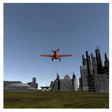
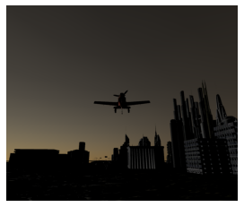
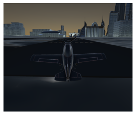
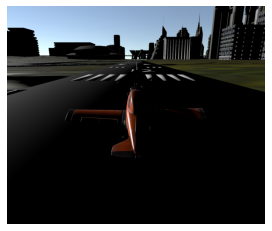

# Aircontrol time of Day API

## Time of Day
Aircontrol allow to control sun position. By controlling the sun position Day and night scenarios can be generated.

## Python API
Python API has a `set_TOD` function to set the time of day properties. 
`set_TOD` function takes the following arguments:
- IsActive (bool, optional): Active if set to `True`. Internal effective compute mechanism. Defaults to False.
- SunLatitude (float, optional): Controls sun Latitude. Defaults to -826.39.
- SunLongitude (float, optional): Controls sun Longitude. Defaults to -1605.4.
- Hour (int, optional): Set Hour. Defaults to 10.
- Minute (int, optional): Set Minutes. Defaults to 5.

## Importing Requirement


```python
from AirControl.communicator import Communicator
from AirControl import schemaDef
from pprint import pprint
import PIL.Image as Image
import base64
import numpy as np

from io import BytesIO
from matplotlib.pyplot import  imshow
import matplotlib.pyplot as plt

connection = Communicator()
```

**Abundant sun light**


```python
TOD_schema = schemaDef.set_TOD(IsActive=1, Minute=1, Hour=13,SunLatitude=-2391.933347, SunLongitude=-2958)
connection.send_data(TOD_schema)
output =  connection.receive_data()
camera_schema = schemaDef.set_camera(ActiveCamera=1, IsCapture=True,CaptureCamera=1,CaptureType=0,CaptureHeight=256,CaptureWidth=256,IsOutput=True)
connection.send_data(camera_schema)
output =  connection.receive_data()
image = output['ScreenCapture']
if image != "":
    im = Image.open(BytesIO(base64.b64decode(image)))
    # im.show()
    imshow(np.asarray(im))
    plt.axis('off')
```


    

    


**Sunset light**


```python
TOD_schema = schemaDef.set_TOD(IsActive=1, Minute=1, Hour=13,SunLatitude=25.933347, SunLongitude=72.712092)
connection.send_data(TOD_schema)
output =  connection.receive_data()
camera_schema = schemaDef.set_camera(ActiveCamera=1, IsCapture=True,CaptureCamera=1,CaptureType=0,CaptureHeight=1080,CaptureWidth=1280,IsOutput=True)
connection.send_data(camera_schema)
output =  connection.receive_data()
image = output['ScreenCapture']
if image != "":
    im = Image.open(BytesIO(base64.b64decode(image)))
    # im.show()
    imshow(np.asarray(im))
    plt.axis('off')
   
```


    

    


**Noon - Sun at vertical angle**


```python
TOD_schema = schemaDef.set_TOD(IsActive=1, Minute=1, Hour=1,SunLatitude=-481.9, SunLongitude=-1517)
connection.send_data(TOD_schema)
output =  connection.receive_data()
camera_schema = schemaDef.set_camera(ActiveCamera=1, IsCapture=True,CaptureCamera=1,CaptureType=0,CaptureHeight=1080,CaptureWidth=1280,IsOutput=True)
connection.send_data(camera_schema)
output =  connection.receive_data()
image = output['ScreenCapture']
if image != "":
    im = Image.open(BytesIO(base64.b64decode(image)))
    # im.show()
    imshow(np.asarray(im))
    plt.axis('off')
```


    

    


**Night**


```python
TOD_schema = schemaDef.set_TOD(IsActive=1, Minute=59, Hour=20,SunLatitude=-2563, SunLongitude=-2939.9)
connection.send_data(TOD_schema)
output =  connection.receive_data()
camera_schema = schemaDef.set_camera(ActiveCamera=1, IsCapture=True,CaptureCamera=1,CaptureType=0,CaptureHeight=1080,CaptureWidth=1280,IsOutput=True)
connection.send_data(camera_schema)
output =  connection.receive_data()
image = output['ScreenCapture']
if image != "":
    im = Image.open(BytesIO(base64.b64decode(image)))
    # im.show()
    imshow(np.asarray(im))
    plt.axis('off')
```


    

    


**Surshine at side angle**


```python
TOD_schema = schemaDef.set_TOD(IsActive=1, Minute=1, Hour=1,SunLatitude=-2391, SunLongitude=-2958)
connection.send_data(TOD_schema)
output =  connection.receive_data()
camera_schema = schemaDef.set_camera(ActiveCamera=1, IsCapture=True,CaptureCamera=1,CaptureType=0,CaptureHeight=1080,CaptureWidth=1280,IsOutput=True)
connection.send_data(camera_schema)
output =  connection.receive_data()
image = output['ScreenCapture']
if image != "":
    im = Image.open(BytesIO(base64.b64decode(image)))
    # im.show()
    imshow(np.asarray(im))
    plt.axis('off')
```


    

    

