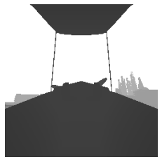

Aircontrol Camera API
=====================

Camera Placement
----------------

AirControl Airplane has two cameras. One is in the Cockpit and another
is a follow camera. Both the camera can be used for capturing
screenshots while in flight.

Python API
----------

| Python API has a ``set_camera`` function to set the camera properties.
  ``set_camera`` function takes the following arguments: -
  InputControlType (str, optional): It can be either ``Code`` or
  ``Other``. This is to control the internal mechanism and prevent
  repeated calling in already set variables.
| If ``InputControlType`` is set to ‘Code’, the camera cannot be
  controlled from Keyboard or Joystick. If ``InputControlType`` is set
  to ‘Other’, the camera can be only controlled from Keyboard or
  Joystick. Defaults to “Code”. - ActiveCamera (int, optional):
  Aircontrol Airplane has two cameras inside the Cockpit and outside the
  Airplane. The Camera inside the Cockpit is indexed as 0. The outside
  of the Airplane is indexed as 1. ``ActiveCamera`` can be used to
  select the scene camera. Defaults to 1. - IsCapture (bool, optional):
  ``Iscapture`` if true the screenshot will be captured. Defaults to
  False. - CaptureCamera (int, optional): ``CaptureCamera`` defines
  which camera should be used for capturing the scene. Defaults to 1. -
  CaptureType (int, optional): Choose between different capture types.
  Defaults to 1. - CaptureWidth (int, optional): Width of the captured
  image. Defaults to 256. - CaptureHeight (int, optional): Height of the
  captured image. Defaults to 256. - IsOutput (bool, optional): By
  default ``set_camera`` function only sets the internal state.
  ``set_camera`` only provides log output and not the actual captured
  image. ``set_control`` when called it returns the actual output. IF
  you want to force ``set_camera`` to return the image, set ``IsOutput``
  to True. Defaults to False.

**Capture Types**

One of the main challenges in Machine Learning is the task of getting
large amounts of training data in the right format. Deep learning, and
machine learning more generally, needs huge training sets to work
properly. Virtual worlds can provide a wealth of training data. However,
it must consist of more than just the final image: object
categorization, optical flow, etc

``Capture Types`` can be set to the following:

+-----+---------+------------------------------------------------------+
| C   | Type    | Details                                              |
| apt |         |                                                      |
| ure |         |                                                      |
| T   |         |                                                      |
| ype |         |                                                      |
+=====+=========+======================================================+
| 0   | Scene   | Capture from scene Camera                            |
|     | Capture |                                                      |
+-----+---------+------------------------------------------------------+
| 1   | I       | Each object in the scene gets unique color           |
|     | nstance |                                                      |
|     | Segme   |                                                      |
|     | ntation |                                                      |
+-----+---------+------------------------------------------------------+
| 2   | S       | Objects are assigned color based on their category   |
|     | emantic |                                                      |
|     | segme   |                                                      |
|     | ntation |                                                      |
+-----+---------+------------------------------------------------------+
| 3   | Depth   | Pixels are colored according to their motion in the  |
|     |         | relation to the camera                               |
+-----+---------+------------------------------------------------------+
| 4   | Normals | Surfaces are colored according to their orientation  |
|     |         | in relation to the camera                            |
+-----+---------+------------------------------------------------------+
| 5   | Optical | Pixels are colored according to their distance from  |
|     | Flow    | the camera (Only visible when Airplane or Object in  |
|     |         | reference are moving)                                |
+-----+---------+------------------------------------------------------+

Implementation details
----------------------

First of all ``AC_Airplane_CameraController.OnSceneChange()`` calls
ColorEncoding class to encode unique object idenitifier and layer as RGB
color. These colors are stored in MaterialPropertyBlock for each object
and are automatically passed into the shaders when rendering.

Upon start ``AC_Airplane_CameraController`` component creates hidden
camera for every single pass of output data (image segmentation, optical
flow, depth, etc). These cameras allow to override usual rendering of
the scene and instead use custom shaders to generate the output. These
cameras are attached to different scene camera using
``Camera.targetDisplay property`` - handy for preview in the Editor.

For Image segmentation and Object categorization pass special
replacement shader is set with \`Camera.SetReplacementShader(). It
overrides shaders that would be otherwise used for rendering and instead
outputs encoded object id or layer.

Optical flow and Depth pass cameras request additional data to be
rendered with ``DepthTextureMode.Depth`` and
``DepthTextureMode.MotionVectors`` flags. Rendering of these cameras is
followed by drawing full screen quad ``CommandBuffer.Blit()`` with
custom shaders that convert 24/16bit-per-channel data into the 8-bit RGB
encoding.

Importing Requirements
----------------------

.. code:: python

   from AirControl.communicator import Communicator
   from AirControl import schemaDef
   from pprint import pprint
   import PIL.Image as Image
   import base64
   import numpy as np
   from io import BytesIO
   from matplotlib.pyplot import  imshow
   import matplotlib.pyplot as plt

   connection = Communicator()

Examples (Cockpit Camera)
-------------------------

**Scene Capture**

.. code:: python

   camera_schema = schemaDef.set_camera(ActiveCamera=1, IsCapture=True,CaptureCamera=0,CaptureType=0,CaptureHeight=256,CaptureWidth=256,IsOutput=True)
   connection.send_data(camera_schema)
   output =  connection.receive_data()
   image = output['ScreenCapture']
   if image != "":
       im = Image.open(BytesIO(base64.b64decode(image)))
       imshow(np.asarray(im))
       plt.axis('off')

.. figure:: ../images/camera_example_files/camera_example_7_0.png
   :alt: png

   png

**Instance Segmentation**

.. code:: python

   camera_schema = schemaDef.set_camera(ActiveCamera=1, IsCapture=True,CaptureCamera=0,CaptureType=1,CaptureHeight=256,CaptureWidth=256,IsOutput=True)
   connection.send_data(camera_schema)
   output =  connection.receive_data()
   image = output['ScreenCapture']
   if image != "":
       im = Image.open(BytesIO(base64.b64decode(image)))
       imshow(np.asarray(im))
       plt.axis('off')

.. figure:: ../images/camera_example_files/camera_example_9_0.png
   :alt: png

   png

**Semantic segmentation**

.. code:: python

   camera_schema = schemaDef.set_camera(ActiveCamera=1, IsCapture=True,CaptureCamera=0,CaptureType=2,CaptureHeight=256,CaptureWidth=256,IsOutput=True)
   connection.send_data(camera_schema)
   output =  connection.receive_data()
   image = output['ScreenCapture']
   if image != "":
       im = Image.open(BytesIO(base64.b64decode(image)))
       imshow(np.asarray(im))
       plt.axis('off')

   png

**Depth**

.. code:: python

   camera_schema = schemaDef.set_camera(ActiveCamera=1, IsCapture=True,CaptureCamera=0,CaptureType=3,CaptureHeight=256,CaptureWidth=256,IsOutput=True)
   connection.send_data(camera_schema)
   output =  connection.receive_data()
   image = output['ScreenCapture']
   if image != "":
       im = Image.open(BytesIO(base64.b64decode(image)))
       imshow(np.asarray(im))
       plt.axis('off')

   png

**Normals**

.. code:: python

   camera_schema = schemaDef.set_camera(ActiveCamera=1, IsCapture=True,CaptureCamera=0,CaptureType=4,CaptureHeight=256,CaptureWidth=256,IsOutput=True)
   connection.send_data(camera_schema)
   output =  connection.receive_data()
   image = output['ScreenCapture']
   if image != "":
       im = Image.open(BytesIO(base64.b64decode(image)))
       imshow(np.asarray(im))
       plt.axis('off')

.. figure:: ../images/camera_example_files/camera_example_15_0.png
   :alt: png

   png

**Optical Flow**

.. code:: python

   camera_schema = schemaDef.set_camera(ActiveCamera=1, IsCapture=True,CaptureCamera=0,CaptureType=5,CaptureHeight=256,CaptureWidth=256,IsOutput=True)
   connection.send_data(camera_schema)
   output =  connection.receive_data()
   image = output['ScreenCapture']
   if image != "":
       im = Image.open(BytesIO(base64.b64decode(image)))
       imshow(np.asarray(im))
       plt.axis('off')

.. figure:: ../images/camera_example_files/camera_example_17_0.png
   :alt: png

   png

Example (External Camera)
-------------------------

**Scene Capture**

.. code:: python

   camera_schema = schemaDef.set_camera(ActiveCamera=1, IsCapture=True,CaptureCamera=1,CaptureType=0,CaptureHeight=256,CaptureWidth=256,IsOutput=True)
   connection.send_data(camera_schema)
   output =  connection.receive_data()
   image = output['ScreenCapture']
   if image != "":
       im = Image.open(BytesIO(base64.b64decode(image)))
       imshow(np.asarray(im))
       plt.axis('off')

.. figure:: ../images/camera_example_files/camera_example_7_0.png
   :alt: png

   png

**Instance Segmentation**

.. code:: python

   camera_schema = schemaDef.set_camera(ActiveCamera=1, IsCapture=True,CaptureCamera=1,CaptureType=1,CaptureHeight=256,CaptureWidth=256,IsOutput=True)
   connection.send_data(camera_schema)
   output =  connection.receive_data()
   image = output['ScreenCapture']
   if image != "":
       im = Image.open(BytesIO(base64.b64decode(image)))
       imshow(np.asarray(im))
       plt.axis('off')

   png

**Semantic segmentation**

.. code:: python

   camera_schema = schemaDef.set_camera(ActiveCamera=1, IsCapture=True,CaptureCamera=1,CaptureType=2,CaptureHeight=256,CaptureWidth=256,IsOutput=True)
   connection.send_data(camera_schema)
   output =  connection.receive_data()
   image = output['ScreenCapture']
   if image != "":
       im = Image.open(BytesIO(base64.b64decode(image)))
       imshow(np.asarray(im))
       plt.axis('off')

.. figure:: ../images/camera_example_files/camera_example_24_0.png
   :alt: png

   png

**Depth**

.. code:: python

   camera_schema = schemaDef.set_camera(ActiveCamera=1, IsCapture=True,CaptureCamera=1,CaptureType=3,CaptureHeight=256,CaptureWidth=256,IsOutput=True)
   connection.send_data(camera_schema)
   output =  connection.receive_data()
   image = output['ScreenCapture']
   if image != "":
       im = Image.open(BytesIO(base64.b64decode(image)))
       imshow(np.asarray(im))
       plt.axis('off')

.. figure:: ../images/camera_example_files/camera_example_26_0.png
   :alt: png

   png

**Normals**

.. code:: python

   camera_schema = schemaDef.set_camera(ActiveCamera=1, IsCapture=True,CaptureCamera=1,CaptureType=4,CaptureHeight=256,CaptureWidth=256,IsOutput=True)
   connection.send_data(camera_schema)
   output =  connection.receive_data()
   image = output['ScreenCapture']
   if image != "":
       im = Image.open(BytesIO(base64.b64decode(image)))
       imshow(np.asarray(im))
       plt.axis('off')

.. figure:: ../images/camera_example_files/camera_example_28_0.png
   :alt: png

   png

**Optical Flow**

.. code:: python

   ## no movement no optcal flow
   camera_schema = schemaDef.set_camera(ActiveCamera=1, IsCapture=True,CaptureCamera=1,CaptureType=5,CaptureHeight=256,CaptureWidth=256,IsOutput=True)
   connection.send_data(camera_schema)
   output =  connection.receive_data()
   image = output['ScreenCapture']
   if image != "":
       im = Image.open(BytesIO(base64.b64decode(image)))
       imshow(np.asarray(im))
       plt.axis('off')

.. figure:: ../images/camera_example_files/camera_example_30_0.png
   :alt: png

   png

Reference
=========

1. `Replacement
   Shaders <https://docs.unity3d.com/Manual/SL-ShaderReplacement.html>`__
2. `Command
   Buffers <https://docs.unity3d.com/Manual/GraphicsCommandBuffers.html>`__
3. `Depth and Motion
   Vectors <https://docs.unity3d.com/Manual/SL-CameraDepthTexture.html>`__
4. `MaterialPropertyBlock <https://docs.unity3d.com/ScriptReference/MaterialPropertyBlock.html>`__
