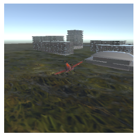
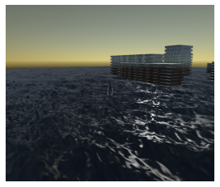
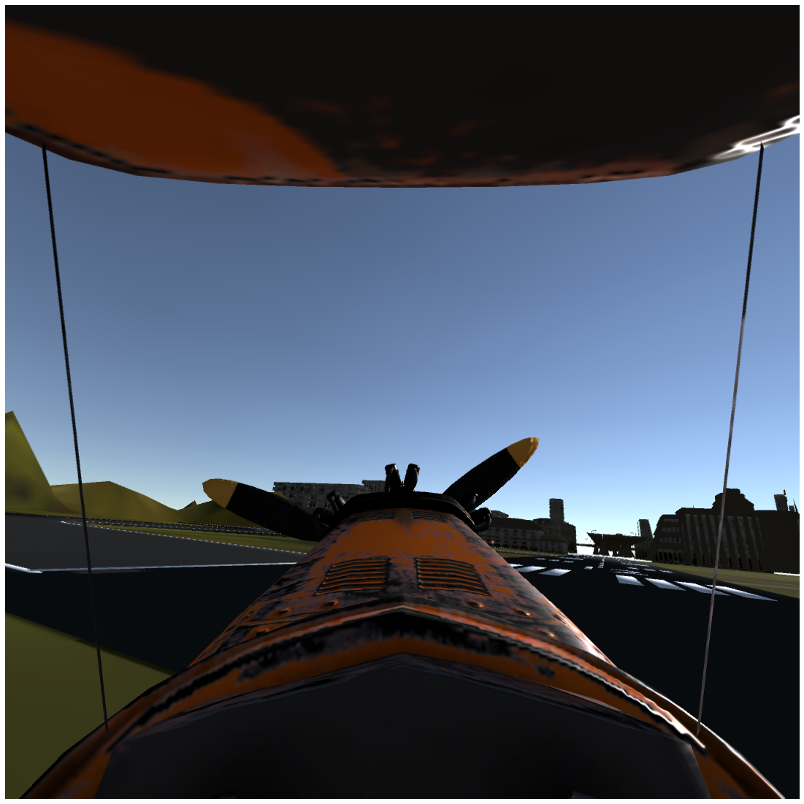
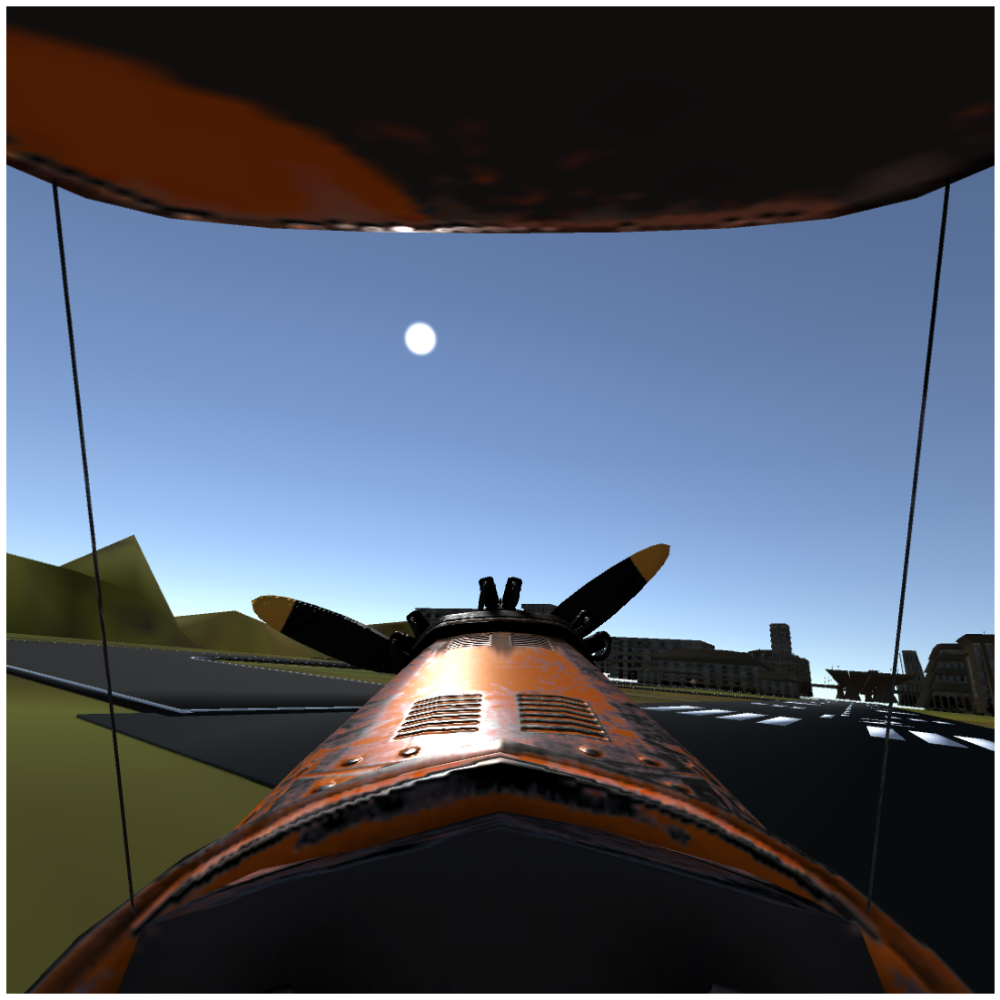
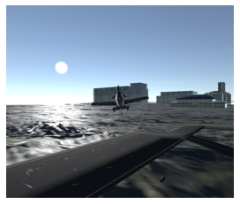

Aircontrol time of Day API
==========================

Time of Day
-----------

Aircontrol allow to control sun position. By controlling the sun
position Day and night scenarios can be generated.

Python API
----------

Python API has a ``set_TOD`` function to set the time of day properties.
``set_TOD`` function takes the following arguments: - IsActive (bool,
optional): Active if set to ``True``. Internal effective compute
mechanism. Defaults to False. - SunLatitude (float, optional): Controls
sun Latitude. Defaults to -826.39. - SunLongitude (float, optional):
Controls sun Longitude. Defaults to -1605.4. - Hour (int, optional): Set
Hour. Defaults to 10. - Minute (int, optional): Set Minutes. Defaults to
5.

Importing Requirement
---------------------

.. code:: ipython3

    from airctrl import environment
    
    from pprint import pprint
    import PIL.Image as Image
    import base64
    import numpy as np
    
    from io import BytesIO
    from matplotlib.pyplot import  imshow
    import matplotlib.pyplot as plt
    A =  environment.Trigger()

.. parsed-literal::

    Now play the environment and call call method `Action.get_connected` to get connected

.. code:: ipython3

    # get connected to server
    A.get_connected()

**Abundant sun light**

.. code:: ipython3

    TOD_output = A.set_TOD(IsActive=1, Minute=1, Hour=13,SunLatitude=-2391.933347, SunLongitude=-2958)
    output = A.set_camera(ActiveCamera=1, IsCapture=True,CaptureCamera=1,CaptureType=0,CaptureHeight=256,CaptureWidth=256,IsOutput=True)
    image = output['ScreenCapture']
    if image != "":
        im = Image.open(BytesIO(base64.b64decode(image)))
        # im.show()
        imshow(np.asarray(im))
        plt.axis('off')
        

**Sunset light**

.. code:: ipython3

    TOD_output = A.set_TOD(IsActive=1, Minute=1, Hour=13,SunLatitude=25.933347, SunLongitude=72.712092)
    output = A.set_camera(ActiveCamera=1, IsCapture=True,CaptureCamera=1,CaptureType=0,CaptureHeight=1080,CaptureWidth=1280,IsOutput=True)
    image = output['ScreenCapture']
    if image != "":
        im = Image.open(BytesIO(base64.b64decode(image)))
        # im.show()
        imshow(np.asarray(im))
        plt.axis('off')
       

**Noon - Sun at vertical angle**

.. code:: ipython3

    TOD_output = A.set_TOD(IsActive=1, Minute=1, Hour=1,SunLatitude=-481.9, SunLongitude=-1517)
    output = A.set_camera(ActiveCamera=1, IsCapture=True,CaptureCamera=1,CaptureType=0,CaptureHeight=1080,CaptureWidth=1280,IsOutput=True)
    image = output['ScreenCapture']
    if image != "":d
        im = Image.open(BytesIO(base64.b64decode(image)))
        # im.show()
        imshow(np.asarray(im))
        plt.axis('off')

**Night**

.. code:: ipython3

    TOD_output = A.set_TOD(IsActive=1, Minute=59, Hour=20,SunLatitude=-500, SunLongitude=-2939.9)
    output = A.set_camera(ActiveCamera=1, IsCapture=True,CaptureCamera=1,CaptureType=0,CaptureHeight=1080,CaptureWidth=1280,IsOutput=True)
    image = output['ScreenCapture']
    if image != "":
        im = Image.open(BytesIO(base64.b64decode(image)))
        # im.show()
        imshow(np.asarray(im))
        plt.axis('off')

.. code:: ipython3

    TOD_output = A.set_TOD(IsActive=1, Minute=1, Hour=1,SunLatitude=-2391, SunLongitude=-2958)
    output = A.set_camera(ActiveCamera=1, IsCapture=True,CaptureCamera=1,CaptureType=0,CaptureHeight=1080,CaptureWidth=1280,IsOutput=True)
    image = output['ScreenCapture']
    if image != "":
        im = Image.open(BytesIO(base64.b64decode(image)))
        # im.show()
        imshow(np.asarray(im))
        plt.axis('off')

