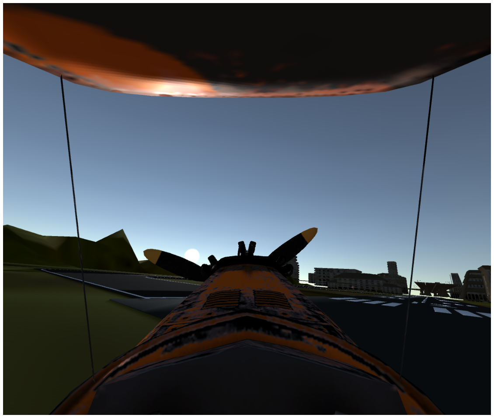

Aircontrol time of Day API
==========================

Time of Day
-----------

Aircontrol allow to control sun position. By controlling the sun
position Day and night scenarios can be generated.

Python API
----------

Python API has a ``set_TOD`` function to set the time of day properties.
``set_TOD`` function takes the following arguments: - IsActive (bool,
optional): Active if set to ``True``. Internal effective compute
mechanism. Defaults to False. - SunLatitude (float, optional): Controls
sun Latitude. Defaults to -826.39. - SunLongitude (float, optional):
Controls sun Longitude. Defaults to -1605.4. - Hour (int, optional): Set
Hour. Defaults to 10. - Minute (int, optional): Set Minutes. Defaults to
5.

Importing Requirement
---------------------

.. code:: ipython3

    from pprint import pprint
    import PIL.Image as Image
    import base64
    import numpy as np
    from io import BytesIO
    from matplotlib.pyplot import  imshow
    import matplotlib.pyplot as plt

.. code:: ipython3

    from airctrl import environment 
    from airctrl import sample_generator
    from airctrl.utils import unity
    from airctrl import sample_generator
    port=8999
    sample = sample_generator.samples()

Use ``Launch()`` class from ``unity`` subpackage to create and object

.. code:: ipython3

    env =  environment.Trigger()
    L = unity.Launch()

.. parsed-literal::

    Now call method `.get_connected(port=<Default 8053>)` to get connected
    

Use function ``launch_executable()`` to launch an environment.
``launch_executable()`` takes path where the executable is located. Use
suitable path according to OS.

.. code:: ipython3

    process = L.launch_executable("/home/supatel/Games/AirControl_2021/Build/1.3.0/Linux/v1.3.0-AirControl.x86_64", server_port=port)
    env.get_connected(port=port)

.. parsed-literal::

    Loading environment from /home/supatel/Games/AirControl_2021/Build/1.3.0/Linux/v1.3.0-AirControl.x86_64 at port 8999 client ip 127.0.1.1 client port 8999
    
    ['/home/supatel/Games/AirControl_2021/Build/1.3.0/Linux/v1.3.0-AirControl.x86_64', '--serverPort', '8999', '--clientIP', '127.0.1.1', '--clientPort', '8999']
    Sleeping for 5 seconds to allow environment load
    
    [UnityMemory] Configuration Parameters - Can be set up in boot.config
        "memorysetup-bucket-allocator-granularity=16"
        "memorysetup-bucket-allocator-bucket-count=8"
        "memorysetup-bucket-allocator-block-size=4194304"
        "memorysetup-bucket-allocator-block-count=1"
        "memorysetup-main-allocator-block-size=16777216"
        "memorysetup-thread-allocator-block-size=16777216"
        "memorysetup-gfx-main-allocator-block-size=16777216"
        "memorysetup-gfx-thread-allocator-block-size=16777216"
        "memorysetup-cache-allocator-block-size=4194304"
        "memorysetup-typetree-allocator-block-size=2097152"
        "memorysetup-profiler-bucket-allocator-granularity=16"
        "memorysetup-profiler-bucket-allocator-bucket-count=8"
        "memorysetup-profiler-bucket-allocator-block-size=4194304"
        "memorysetup-profiler-bucket-allocator-block-count=1"
        "memorysetup-profiler-allocator-block-size=16777216"
        "memorysetup-profiler-editor-allocator-block-size=1048576"
        "memorysetup-temp-allocator-size-main=4194304"
        "memorysetup-job-temp-allocator-block-size=2097152"
        "memorysetup-job-temp-allocator-block-size-background=1048576"
        "memorysetup-job-temp-allocator-reduction-small-platforms=262144"
        "memorysetup-temp-allocator-size-background-worker=32768"
        "memorysetup-temp-allocator-size-job-worker=262144"
        "memorysetup-temp-allocator-size-preload-manager=262144"
        "memorysetup-temp-allocator-size-nav-mesh-worker=65536"
        "memorysetup-temp-allocator-size-audio-worker=65536"
        "memorysetup-temp-allocator-size-cloud-worker=32768"
        "memorysetup-temp-allocator-size-gfx=262144"
    Connecting with port 8999
    

**Abundant sun light**

.. code:: ipython3

    TOD_output = env.set_TOD(IsActive=1, Minute=1, Hour=13,SunLatitude=90.933347, SunLongitude=90)
    output = env.set_camera(ActiveCamera=1, IsCapture=True,CaptureCamera=1,CaptureType=0,CaptureHeight=1080,CaptureWidth=1080,IsOutput=True)
    image = output['ScreenCapture']
    if image != "":
        im = Image.open(BytesIO(base64.b64decode(image)))
    #     im.show()
        plt.figure(figsize = (20,20))
        imshow(np.asarray(im))
        plt.axis('off')
        

.. image:: time_of_day_API_files/time_of_day_API_10_0.png

**Sunset light**

.. code:: ipython3

    TOD_output = env.set_TOD(IsActive=1, Minute=1, Hour=13,SunLatitude=25.933347, SunLongitude=72.712092)
    output = env.set_camera(ActiveCamera=1, IsCapture=True,CaptureCamera=1,CaptureType=0,CaptureHeight=1080,CaptureWidth=1280,IsOutput=True)
    image = output['ScreenCapture']
    if image != "":
        im = Image.open(BytesIO(base64.b64decode(image)))
        # im.show()
        plt.figure(figsize = (20,20))
        imshow(np.asarray(im))
        plt.axis('off')
       

.. image:: time_of_day_API_files/time_of_day_API_12_0.png

**Noon - Sun at vertical angle**

.. code:: ipython3

    TOD_output = env.set_TOD(IsActive=1, Minute=1, Hour=1,SunLatitude=-481.9, SunLongitude=-1517)
    output = env.set_camera(ActiveCamera=0, IsCapture=True,CaptureCamera=0,CaptureType=0,CaptureHeight=1080,CaptureWidth=1280,IsOutput=True)
    image = output['ScreenCapture']
    if image != "":
        im = Image.open(BytesIO(base64.b64decode(image)))
        # im.show()
        plt.figure(figsize = (20,20))
        imshow(np.asarray(im))
        plt.axis('off')

**Night**

.. code:: ipython3

    TOD_output = env.set_TOD(IsActive=1, Minute=59, Hour=20,SunLatitude=-500, SunLongitude=-2939.9)
    output = env.set_camera(ActiveCamera=1, IsCapture=True,CaptureCamera=1,CaptureType=0,CaptureHeight=1080,CaptureWidth=1280,IsOutput=True)
    image = output['ScreenCapture']
    if image != "":
        im = Image.open(BytesIO(base64.b64decode(image)))
        # im.show()
        plt.figure(figsize = (20,20))
        imshow(np.asarray(im))
        plt.axis('off')

.. code:: ipython3

    TOD_output = env.set_TOD(IsActive=1, Minute=1, Hour=1,SunLatitude=-2391, SunLongitude=-500)
    output = env.set_camera(ActiveCamera=1, IsCapture=True,CaptureCamera=1,CaptureType=0,CaptureHeight=1080,CaptureWidth=1280,IsOutput=True)
    image = output['ScreenCapture']
    if image != "":
        im = Image.open(BytesIO(base64.b64decode(image)))
        # im.show()
        plt.figure(figsize = (20,20))
        imshow(np.asarray(im))
        plt.axis('off')

