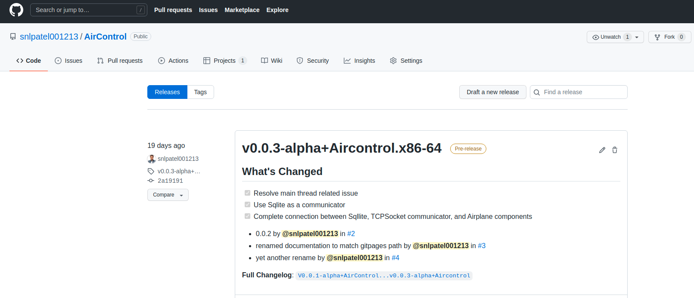

Working With Binaries
=====================

Working with binaries with Aircontrol is really-really easy. Here are
few steps to download and get started with the binaries:

1. Go to the Release Page
   |https://github.com/snlpatel001213/AirControl/releases| Link :
   https://github.com/snlpatel001213/AirControl/releases

2. Aircontrol releasesd are avaialble for Linux Windows and Mac.
   Download one according to your OS.

3. Start Aircontrol with executable you just downloaded

Starting with Python API
------------------------

1. Clone Aircontrol Repository Github

   ``https://github.com/snlpatel001213/AirControl.git``

2. Go to Aircontrol_20/Assets/Python

   ``cd Aircontrol/Python``

3. Install Aircontrol python package

   ``path/to/python setup.py install``

4. Get started with python notebooks

   ``cd Aircontrol/Python/client_examples``

