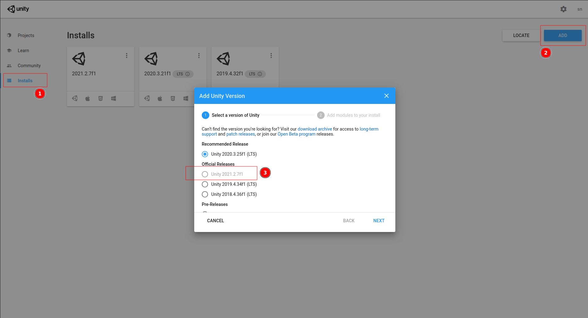

Working With Sources
====================

Clone the source code
---------------------

1. Clone Aircontrol Repository Github

   ``https://github.com/snlpatel001213/AirControl.git``

2. Go to Aircontrol_20/Assets/Python

   ``cd Aircontrol/Python``

3. Install Aircontrol python package

   ``path/to/python setup.py install``

Download Unity Engine
---------------------

Follow the instruction given at : https://unity.com/download

1. Download the Unity Hub : Follow the instructions onscreen for
   guidance through the installation process and setup. |image0|
2. Choose your Unity version Aircontrol is developed on Unity version
   ``2021.2.7f1`` |image1|
3. on pressing next, select Linux, Mac or Windows support, you may
   select all or one according to your OS. |image2|

Add Aircontrol Project to Unity
-------------------------------

1. Start Unity Hub and add new project to it |image3|
2. Once added Aircontrol project to Hub, launch it. |image4|
3. Finally you will see the project loaded to the Unity. |image5|

.. |image0| image:: ../images/git_clone.png

.. |image2| image:: ../images/unity_addons.png
.. |image3| image:: ../images/unity-select-project.png
.. |image4| image:: ../images/unity_launch.png
.. |image5| image:: ../images/unity_new_project.png
